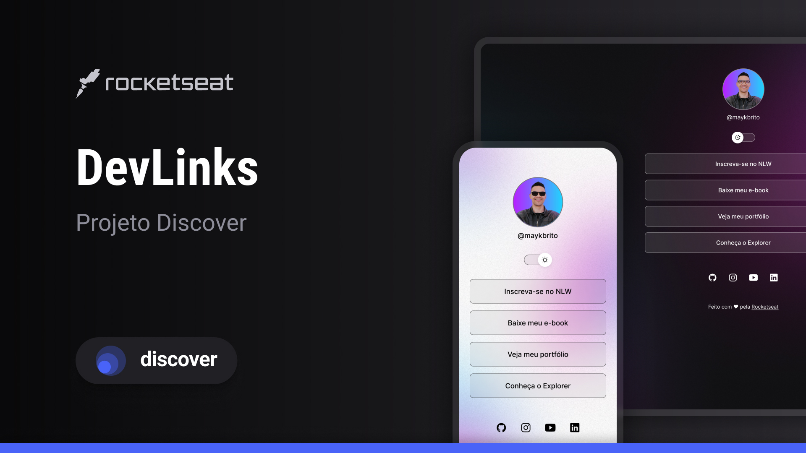

<h1 align="center"> projetinho </h1>

 projeto feito através de aulas na Rocketseat 

  

## Esse projeto foi desenvolvido utilizando as seguintes tecnologias:
- HTML e CSS
- JavaScript
- Git e Github
- Figma

## Projeto
O DevLinks é um agregador de links para usar como cartão de visitas online.

## Layout
Você pode visualizar o layout do projeto através [DESSE LINK] (https://www.figma.com/design/DgdfaOqDCdDevCyLbcySy3/DevLinks-%E2%80%A2-Projeto-Discover--Community-?node-id=10-620&p=f&t=gkUGAVgfWPOaQUKK-0). É necessário ter conta no [Figma] (https://figma.com) para acessá-lo.

## Liçenca
Este projeto está sobre licença MIT.

Feito com ♥ by Rocketseat